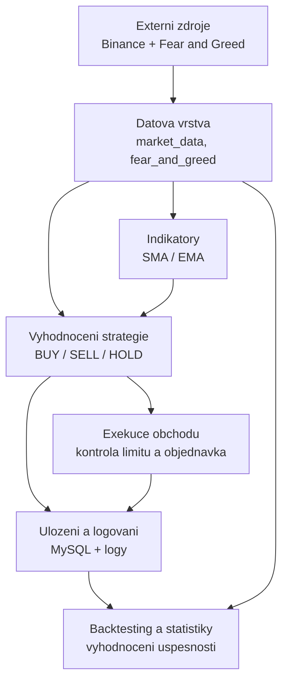

# 5. Logický pohled

Tato sekce popisuje logickou dekompozici systému do Python modulů a balíčků. Projekt je rozdělen podle odpovědností: načítání tržních a sentimentových dat, výpočet technických indikátorů, vyhodnocení obchodní strategie, exekuce obchodů, ukládání výsledků a následná evaluace. Hlavní důraz je kladen na jednoduchou rozšiřitelnost, aby bylo možné doplnit nebo upravit konkrétní obchodní strategii bez zásahu do ostatních částí systému.

## 5.1 Přehled

### 5.1.1 Datová vrstva

Datová vrstva zajišťuje komunikaci s externími zdroji a předává ostatním částem aplikace konzistentní vstupní data.

- `common.market_data`: vytváří Binance klienta a načítá historické cenové hodnoty pro zvolený obchodní pár.
- `common.fear_and_greed`: načítá Fear and Greed index z CoinMarketCap API.
- `config_loader`: načítá konfigurační parametry strategie, intervaly, limity a nastavení logování.

### 5.1.2 Indikátory technické analýzy

Tato část obsahuje samostatné Python funkce pro výpočet technických indikátorů nad cenovými daty.

- `sma.compute_sma`: počítá Simple Moving Average z posledních cen.
- `ema.ema_indicator`: počítá Exponential Moving Average pomocí knihovny TA-Lib.

Každý indikátor je oddělený do vlastního modulu, takže lze strategii rozšiřovat o další výpočty bez změny datové vrstvy nebo exekuce obchodů.

### 5.1.3 Vyhodnocení strategie

Jádro systému je v modulech `sma.main` a `ema.main`. Funkce `evaluate_market` kombinuje aktuální cenu, technický indikátor a Fear and Greed index. Výsledkem je rozhodnutí `BUY`, `SELL` nebo `HOLD` včetně důvodu rozhodnutí a vstupních hodnot použitých při výpočtu.

U SMA varianty se navíc počítá síla signálu podle vzdálenosti ceny od SMA a intenzity sentimentu. Na základě této síly a konfiguračních pravidel se určuje velikost pozice.

### 5.1.4 Exekuce objednávek

Exekuční vrstva pracuje s Binance účtem a provádí obchodní akce pouze tehdy, když strategie vygeneruje platný signál a zároveň jsou splněny limity nastavené v konfiguraci.

- `sma.new_cm_order` a `ema.order_executor`: kontrolují zůstatky, Binance limity a odesílají nákupní nebo prodejní příkazy.
- V režimu `dry_run` lze chování strategie ověřovat bez reálného odesílání obchodů.

### 5.1.5 Perzistence, logování a statistiky

Tato část slouží k uchování průběhu obchodování a k pozdějšímu vyhodnocení úspěšnosti.

- `database`: ukládá jednotlivá rozhodnutí strategie a provedené nebo simulované obchody do MySQL databáze.
- `common.logging_init`: nastavuje souborové a konzolové logování.
- `sma.evaulation`: obsahuje nástroje pro načtení uložených dat, výpočet statistik a tvorbu grafů.
- `sma.backtesting` a `ema.ema_backtest`: umožňují ověřit strategii nad historickými daty.

### 5.1.6 Testy a automatická kontrola

Adresář `tests` obsahuje automatizované testy pro klíčové části projektu, například načítání tržních dat, Fear and Greed indexu, výpočty indikátorů a exekuci nákupních nebo prodejních rozhodnutí. Testy slouží jako kontrola, že změny ve strategii nebo pomocných modulech neporuší základní funkčnost systému.

## 5.2 Use-case realizace

Typický scénář jednoho běhu aplikace probíhá následovně:

1. Aplikace načte konfiguraci a vytvoří klienta pro Binance.
2. Datová vrstva stáhne historické ceny z Binance a aktuální Fear and Greed index.
3. Modul indikátoru vypočítá SMA nebo EMA nad historickými cenami.
4. Funkce `evaluate_market` vyhodnotí kombinaci technického indikátoru a sentimentu.
5. Strategie vrátí signál `BUY`, `SELL` nebo `HOLD`.
6. Exekuční vrstva ověří zůstatky, interní limity a minimální požadavky Binance.
7. Pokud jsou podmínky splněné, odešle se obchodní příkaz, případně se v režimu `dry_run` pouze zaloguje simulovaná akce.
8. Rozhodnutí se uloží do databáze a zapíše do logu.
9. Backtesting a evaluační moduly mohou nad uloženými nebo historickými daty spočítat statistiky úspěšnosti.

## 5.3 Diagram logického pohledu

