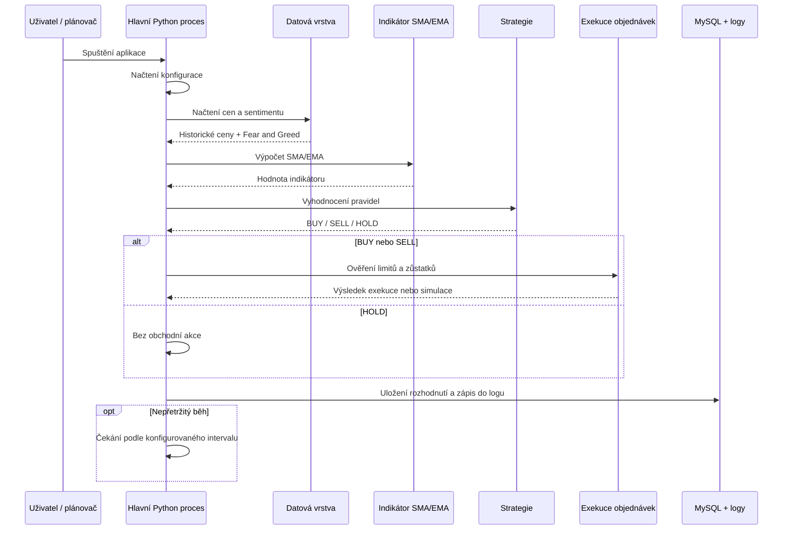

# 6. Procesní pohled

Tato sekce popisuje běhové chování systému a pořadí kroků při vyhodnocení obchodní strategie. Aplikace je navržena jako periodicky spouštěný Python proces, nikoli jako vícevláknová realtime aplikace. V jednom cyklu se načte konfigurace, stáhnou se aktuální vstupní hodnoty, vypočítá se technický indikátor, vyhodnotí se obchodní pravidla a výsledek se uloží do databáze a logu.

Systém může běžet jednorázově pomocí parametru `--once`, nebo v nekonečné smyčce, kde se jednotlivé cykly opakují podle intervalu nastaveného v konfiguraci.

## 6.1 Rozklad procesů

### 6.1.1 Hlavní běhový proces

Hlavní proces je spuštěn modulem `sma.main` nebo `ema.main`. Zajišťuje inicializaci aplikace, načtení konfigurace, vytvoření Binance klienta a opakované spouštění obchodního cyklu.

V režimu nepřetržitého běhu proces po dokončení jednoho cyklu počká nastavený počet sekund a poté celý postup zopakuje.

### 6.1.2 Sběr dat

Sběr dat probíhá v rámci aktuálního obchodního cyklu. Aplikace přes REST API načte historické ceny z Binance a samostatně získá Fear and Greed index z CoinMarketCap API.

Data nejsou předávána přes sdílenou paměťovou frontu. Funkce vracejí běžné Python datové struktury, které jsou následně použity ve výpočtech strategie.

### 6.1.3 Výpočet a analýza

Po načtení vstupních dat se vypočítá zvolený technický indikátor. SMA varianta používá jednoduchý klouzavý průměr, EMA varianta exponenciální klouzavý průměr.

Výpočet probíhá synchronně v rámci stejného cyklu. Pokud není k dispozici dostatek historických cen nebo chybí sentimentová data, strategie vrátí bezpečný stav `HOLD`.

### 6.1.4 Strategie a obchodní příkazy

Strategická část porovná aktuální cenu s vypočteným indikátorem a zároveň zohlední Fear and Greed index. Výsledkem je signál `BUY`, `SELL` nebo `HOLD`.

Pokud je vygenerován signál `BUY` nebo `SELL`, exekuční vrstva nejprve ověří dostupné zůstatky, nastavené limity a minimální požadavky burzy. Teprve poté může dojít k odeslání objednávky. V režimu `dry_run` se obchod pouze simuluje a zapisuje do logu.

### 6.1.5 Uložení výsledků

Na konci cyklu se rozhodnutí strategie uloží do MySQL databáze a současně se zapíše do logu. Tato data lze později použít pro evaluaci, statistiky a backtesting.

## 6.2 Mechanismy komunikace

Komunikace mezi částmi systému probíhá jednoduše pomocí volání funkcí a předávání návratových hodnot.

- Volání funkcí: hlavní proces postupně volá funkce pro načtení dat, výpočet indikátorů, vyhodnocení strategie a exekuci obchodů.
- Návratové hodnoty: cenová data, sentiment, vypočtený indikátor a obchodní signál jsou předávány jako běžné Python hodnoty nebo slovníky.
- Databáze: MySQL slouží k trvalému uložení rozhodnutí strategie a záznamů o obchodech.
- Logování: logovací modul ukládá průběh běhu, chyby a informace o provedených nebo simulovaných akcích.

Systém tedy nepoužívá samostatná výpočetní vlákna, sdílenou paměť ani frontu zpráv. Tento jednodušší model odpovídá charakteru semestrálního projektu a usnadňuje testování i ladění strategie.

## 6.3 Diagram procesního pohledu

